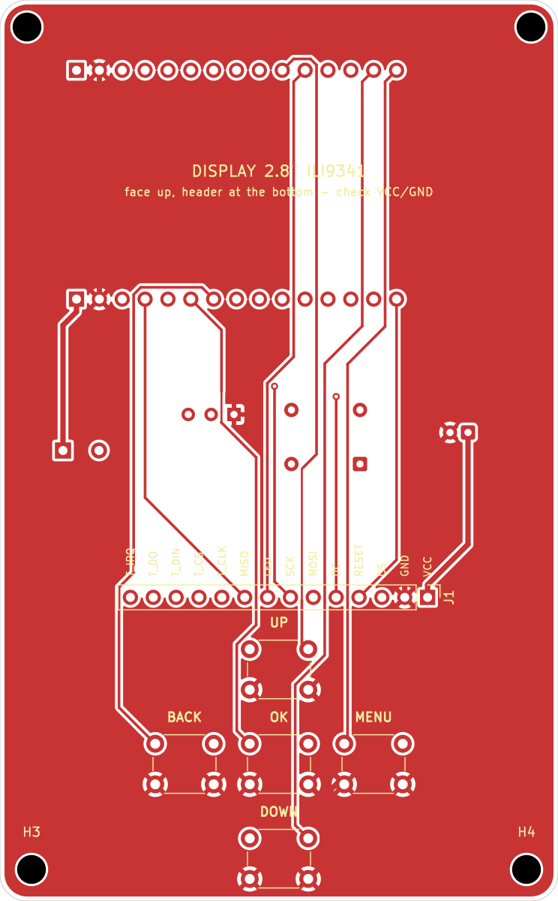
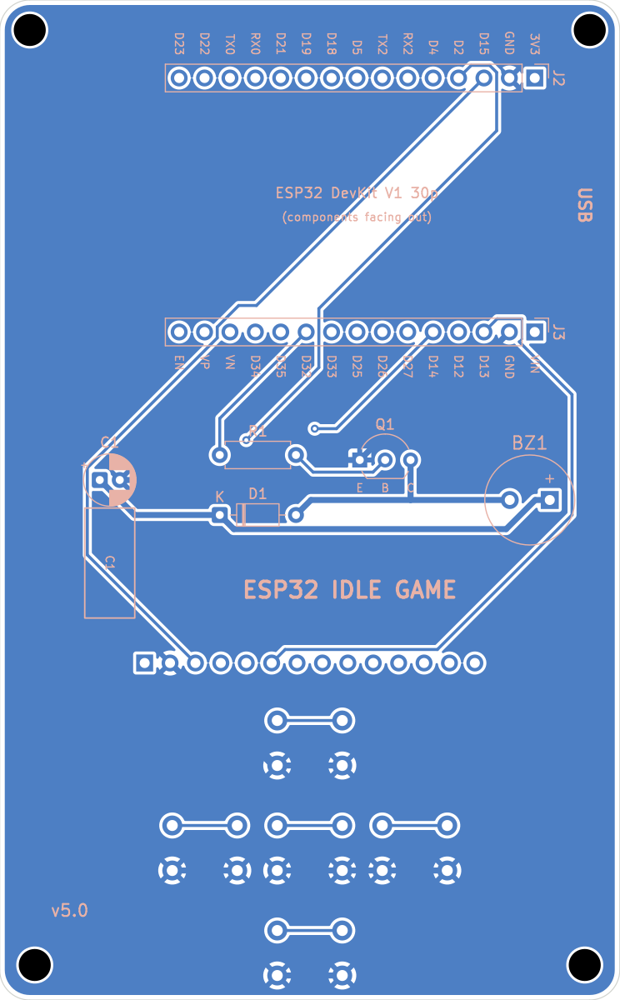
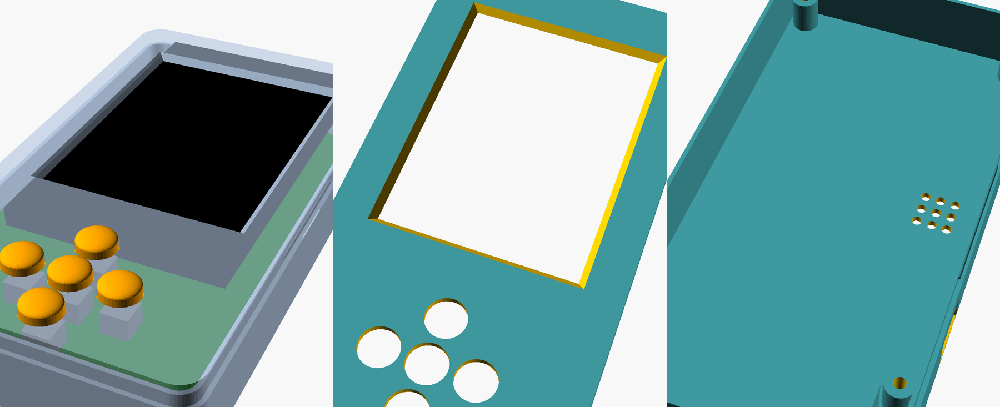

# Placa do ESP32 Idle Game (v5)

Placa portátil de **62×100 mm**, 2 camadas, só com componentes PTH (fáceis de soldar à mão). Cabe na faixa mais barata da JLCPCB (US$ 2 por 5 placas).

- **Frente:** display de 2.8" no alto e a cruz de botões embaixo. OK fica no meio, UP em cima, DOWN embaixo, BACK à esquerda e MENU (próxima tela) à direita.
- **Verso:** a ESP32 deitada atrás do display, com o USB saindo pela lateral esquerda (vista de frente). Logo abaixo dela ficam o buzzer, R1, Q1, D1 e C1.

**O display de 2.8" não cabe inteiro numa placa de 100 mm** acima dos botões. Por isso o conector dele fica na borda de baixo do módulo, logo acima da cruz, e os ~17 mm de cima passam da borda da placa, apoiados em trilhos da case. Assim a PCB continua na faixa de US$ 2.

**O display e a ESP32 vão soldados direto na placa**, sem soquete. Isso deixa a case com **21 mm** de espessura, mas para tirar um deles depois é preciso dessoldar.

| Frente | Verso (visto por trás) |
|---|---|
|  |  |

## Arquivos

- `fab/esp32-idle-game-gerbers.zip`: o arquivo que se envia para a fábrica.
- `esp32-idle-game.kicad_pcb`: a placa, que abre no KiCad 10.
- `bom.csv`: lista de componentes por referência.
- `generate_pcb.py` e `build.sh`: geram tudo do zero (posicionamento, roteamento com Freerouting, plano de terra, DRC, Gerbers e prévias). Mudanças se fazem no `.py`, não no KiCad.
- `case/`: a case impressa em 3D (seção 7).

```bash
hardware/build.sh ~/Downloads/freerouting-2.5.0.jar   # requer kicad 10 e java
```

## 1. Fabricar a PCB

**JLCPCB:** https://cart.jlcpcb.com/quote

1. Clique em **Add gerber file** e envie `fab/esp32-idle-game-gerbers.zip`. O tamanho de 62×100 mm é lido sozinho.
2. Deixe o padrão: FR-4, **2 layers**, **5 unidades**, espessura 1.6 mm, HASL. A cor verde é a mais barata e a mais rápida.
3. Não marque **PCB Assembly**: a montagem é manual.
4. No frete, escolha o mais barato que tenha rastreio (Global Standard Direct ou similar).

A JLCPCB imprime um número de pedido na serigrafia. Para tirar, escolha "Remove Mark" (custa um pouco a mais).

Alternativas: **PCBWay** (https://www.pcbway.com/orderonline.aspx), com as mesmas opções, ou a **PCB Brasil** (https://pcbbrasil.com.br/prototipos), que fabrica aqui e não paga importação.

A placa chega em 1 a 3 semanas. A importação de PCB paga imposto de importação mais ICMS sobre placa e frete.

## 2. Lista de compras (uma unidade)

Duas listas com tudo o que entra numa unidade montada: uma comprando só no Brasil, outra só no exterior. Os preços são estimativas de out/2026, com dólar a R$ 5,50. Os links levam a buscas ou a produtos de referência; confira as medidas no anúncio antes de comprar.

### Comprando no Brasil

| Qtd | Item | Onde | ~R$ |
|---|---|---|---|
| 1 | ESP32 DevKit V1, **30 pinos** | [Mercado Livre](https://lista.mercadolivre.com.br/esp32-30-pinos) | 33 – 60 |
| 1 | Display TFT **2.8"** ILI9341 SPI (14 pinos, com ou sem touch) | [Mercado Livre](https://lista.mercadolivre.com.br/display-tft-ili9341) | 64 – 93 |
| 5 | Chave táctil 6×6×5 mm | [Eletrogate](https://www.eletrogate.com/push-button-chave-tactil-6x6x5mm) | 0,75 |
| 1 | Buzzer passivo 9 mm, 5 V | [Saravati](https://www.saravati.com.br/buzzer-9mm-5v-passivo.html) | 2 |
| 1 | Transistor S8050 (ou 2N2222A) | [Mercado Livre](https://lista.mercadolivre.com.br/transistor-s8050) | 0,30 – 1 |
| 1 | Diodo 1N4148 | [Mercado Livre](https://lista.mercadolivre.com.br/diodo-1n4148) | 0,10 – 0,30 |
| 1 | Resistor 1 kΩ 1/4 W | [Mercado Livre](https://lista.mercadolivre.com.br/resistor-1k-1-4w) | 0,10 |
| 1 | Capacitor eletrolítico 100 µF 16 V (5×11 mm) | [Mercado Livre](https://lista.mercadolivre.com.br/capacitor-eletrolitico-100uf-16v) | 0,30 – 1 |
| 4 | Parafuso M3×6 | [Mercado Livre](https://lista.mercadolivre.com.br/parafuso-m3x6) | 2 – 5 |
| 1 | PCB 62×100 mm, 2 camadas (lote de 5) | [PCB Brasil](https://pcbbrasil.com.br/prototipos) (cotação online com o zip) | a cotar |
| ~50 g | Filamento PLA para a case | Se já tiver impressora | 5 – 8 |
| — | Frete de 2 a 3 lojas | | 30 – 60 |
| | **Total, sem a PCB** | | **~140 – 230 (típico ~165)** |

O display de 2.8" é fácil de achar no Brasil, o que deixa a compra nacional mais em conta do que com a tela de 2.2".

Não encontrei preço publicado da PCB Brasil. Para comparar, envie `fab/esp32-idle-game-gerbers.zip` na cotação. Se der menos de uns R$ 140 pelas 5 placas entregues, sai mais barato que a JLCPCB.

### Comprando no exterior (AliExpress + JLCPCB)

| Qtd | Item | Busca | ~US$ |
|---|---|---|---|
| 1 | ESP32 DevKit V1, **30 pinos** | [AliExpress](https://www.aliexpress.com/w/wholesale-esp32-devkit-v1-30pin.html) | 3 |
| 1 | Display TFT **2.8"** ILI9341 SPI (14 pinos, 50×86 mm) | [AliExpress](https://www.aliexpress.com/w/wholesale-2.8-tft-lcd-ili9341.html) | 6 |
| 1 pct | Chave táctil 6×6×5 mm | [AliExpress](https://www.aliexpress.com/w/wholesale-tactile-switch-6x6x5mm.html) | 1 |
| 1 pct | Buzzer passivo 9×5,5 mm, 5 V | [AliExpress](https://www.aliexpress.com/w/wholesale-passive-buzzer-9x5.5mm-5v.html) | 1 |
| 1 pct | Transistor S8050, TO-92 | [AliExpress](https://www.aliexpress.com/w/wholesale-s8050-to-92-transistor.html) | 1 |
| 1 pct | Diodo 1N4148 | [AliExpress](https://www.aliexpress.com/w/wholesale-1n4148-diode.html) | 0,5 |
| 1 pct | Resistor 1 kΩ 1/4 W | [AliExpress](https://www.aliexpress.com/w/wholesale-resistor-1k-1%2F4w.html) | 0,5 |
| 1 pct | Capacitor eletrolítico 100 µF 16 V, 5×11 mm | [AliExpress](https://www.aliexpress.com/w/wholesale-electrolytic-capacitor-100uf-16v-5x11.html) | 0,5 |
| 1 pct | Parafuso M3×6 | [AliExpress](https://www.aliexpress.com/w/wholesale-m3x6-screw.html) | 1 |
| | AliExpress, subtotal | | 14,50 |
| | + ICMS (pedido até US$ 50, Remessa Conforme) | | ≈ 18,10 → **R$ 100** |
| 5 | PCB 62×100 mm (JLCPCB), US$ 2 + frete Global Standard ~US$ 11 | [JLCPCB](https://cart.jlcpcb.com/quote) | 13 |
| | + imposto de importação 60% e ICMS | | ≈ 26 → **R$ 143** |
| ~50 g | Filamento PLA para a case | | R$ 5 – 8 |
| | **Total** | | **~R$ 250** |

No exterior, os pacotes de peças pequenas e as 4 PCBs que sobram já dão para montar mais unidades. A segunda unidade custa só a ESP32 e o display, uns R$ 60 a mais.

### Qual compensa

- **Uma unidade:** no Brasil, as peças dão uns R$ 165 com frete, mais a cotação da PCB Brasil. No exterior, sai tudo por uns R$ 250, com 3 a 6 semanas de espera. Para uma unidade, comprar as peças aqui costuma ganhar.
- **Duas ou mais unidades:** o exterior ganha. As peças são muito mais baratas e a PCB já vem em lote de 5.

## 3. Ferramentas

- Ferro de solda (ponta fina, ~330 °C) e estanho 0,8 mm com fluxo
- **Alicate de corte rente** (indispensável: vários terminais precisam ficar rentes à placa)
- Multímetro (para o teste de continuidade)
- Fita crepe ou massinha, para segurar as peças enquanto solda

## 4. Montagem

A regra geral: **cada peça entra pelo lado em que fica e é soldada pelo lado oposto.**

O display fica a só 2,5 mm da frente da placa, e a ESP32 a 2,5 mm do verso. Por isso, **todo terminal soldado embaixo deles precisa ser cortado rente**, a menos de 1 mm. E a ordem importa: a ESP32 vem antes do display, porque a solda dela fica escondida embaixo do display.

### Antes de começar: confira
1. **Ordem dos pinos do display.** Acima do J1, na frente da placa, estão impressos os nomes dos 14 pinos (VCC, GND, CS… T_IRQ). Com o display de face para cima e o conector embaixo, o VCC fica à **direita**. Compare com a marcação do seu módulo. Se estiver espelhado, **não solde**: inverta `DISPLAY_PINS` no `generate_pcb.py` e gere a placa de novo.
2. **Largura da ESP32.** Meça a distância entre as duas fileiras de pinos, centro a centro. Precisa dar 25,4 mm.
3. **A ESP32 funciona?** Ligue-a no USB e grave o jogo (seção 6) antes de soldar. Depois de soldada, trocar dá trabalho.

### Verso (lado azul na prévia): componentes abaixo da ESP32
4. **R1 (1 kΩ):** dobre as pernas, encaixe pelo verso e solde pela frente. Não tem polaridade.
5. **D1 (1N4148):** a faixa preta do diodo vai do lado marcado **K**.
6. **Q1 (S8050):** as pernas seguem as letras **E B C** impressas. Empurre até o corpo ficar a ~1 mm da placa.
7. **Buzzer:** a perna **+** vai no pad quadrado (marcado com +). Encostado na placa.
8. **C1 (100 µF):** a perna longa (+) vai no pad marcado com **+**. Dobre as pernas a 90° rente ao corpo e deite o capacitor sobre o retângulo "C1" impresso, na direção dos botões.
9. Corte rente, na frente, as pernas de todos eles: essa área fica embaixo do display.

### Frente (lado vermelho na prévia)
10. **Botões:** os cinco encaixam por pressão. Solde as 4 pernas de cada um, conferindo se ficaram rentes à placa.

### Teste antes dos módulos
11. Com o multímetro em continuidade, meça entre os pads **VIN** e **GND** do J3 (verso). **Não pode apitar.** Se apitar, há um curto: procure uma ponte de solda.
12. Aperte cada botão e meça entre o pad dele no J2/J3 (D19, D22, D27, D26 e D23) e o GND. Deve apitar só enquanto o botão estiver apertado.

### ESP32 (verso)
13. Encaixe os pinos da ESP32 pelo **verso**, deitada, **com os componentes virados para fora e o USB voltado para a borda esquerda** (vista pela frente; pelo verso, fica à direita, onde está escrito "USB"). O espaçador plástico dos pinos deve encostar na placa.
14. Solde pela frente: primeiro um pino de cada ponta, confira se ficou reta, depois o resto.
15. **Corte rente todos os 30 pinos na frente.** Eles ficam embaixo do display.

### Display (frente)
16. Encaixe os 14 pinos do display pela **frente**, de face para cima e **com o conector embaixo**, perto dos botões. O espaçador plástico deve encostar na placa, e o resto do módulo passa da borda de cima.
17. Solde pelo verso, logo acima dos botões, e corte as pontas. Até a placa entrar na case, segure o display com cuidado: a parte que passa da placa fica sem apoio.

### Acabamento
18. Monte na case (seção 7) ou, sem case, parafuse 4 espaçadores M3 de 12 mm no verso como pés.

## 5. Primeiro teste

Ligue o USB. O LED vermelho da ESP32 deve acender, o display deve mostrar o jogo e o buzzer deve tocar ao apertar MENU.

Se a tela ficar branca, confira as soldas do display. Se nada acender, desligue e refaça o teste de VIN e GND.

## 6. Gravar o jogo

Com a ESP32 conectada ao computador:

```bash
~/.platformio/penv/bin/pio run -t upload
```

O display de 2.8" usa o mesmo controlador (ILI9341) e a mesma resolução, então a configuração não muda. Como o conector fica embaixo, a imagem pode aparecer de cabeça para baixo: troque `tft.setRotation(2)` por `tft.setRotation(0)` em `src/main.cpp`, ou o contrário. Dá para gravar de novo a qualquer momento, com tudo já montado, pelo USB na lateral esquerda da case.

## 7. Case impressa em 3D

Os arquivos estão em `case/`: o modelo paramétrico `case.scad` (OpenSCAD) e três STLs prontos para fatiar.



| Arquivo | Peça | Como imprimir |
|---|---|---|
| `case_bottom.stl` | Bandeja: a PCB é parafusada nela; a ESP32 fica dentro | Fundo na mesa |
| `case_top.stl` | Moldura com a janela do display e os furos da cruz | **De cabeça para baixo** (face externa na mesa) |
| `case_caps.stl` | 5 botões, que levam o toque da tampa até as chaves | Base na mesa |

**Impressão:** PLA ou PETG, camada de 0,2 mm, 3 perímetros, 20% de preenchimento. Nenhuma peça precisa de suporte. As medidas externas ficam em 67×122×21 mm.

**Montagem:**
1. Comece com a placa já montada (ESP32 e display soldados).
2. Coloque a placa na bandeja, com o USB alinhado à abertura da parede esquerda e o display apoiado nos dois trilhos da parte de cima. Prenda com os 4 parafusos M3×6 pela frente. Os furos de 2,6 mm são para o parafuso abrir rosca no plástico; não aperte demais.
3. Ponha os 5 botões impressos nos furos da moldura, por dentro, com a base larga virada para dentro.
4. Segurando os botões, encaixe a moldura na bandeja até ouvir o clique dos dois lados. Para abrir, use o entalhe na lateral direita.

**Se não encaixar direito**, ajuste no topo do `case.scad` e exporte de novo:
- `switch_h`: altura da sua chave táctil, da placa ao topo do botão. O padrão é 5 mm (6×6×5). Se os botões impressos ficarem frouxos ou duros, o problema é este valor.
- `cap_d`: diâmetro visível dos botões (8,5 mm, o máximo para o espaçamento de 10,5 mm da placa). Diminua se preferir mais plástico entre os furos.
- `display_thick`: espessura do módulo do display (placa + vidro). O padrão é 4,5 mm.
- `window` e `display_center`: tamanho e posição da janela, caso a área visível do seu display fique deslocada.
- `fit`: folga do encaixe da moldura. Aumente para 0,25 se ficar justo demais.

```bash
openscad -D 'part="bottom"' -o case_bottom.stl case.scad   # também: top, caps
```

## Ligações (referência)

| ESP32 | Vai para |
|---|---|
| VIN (5 V do USB) | Display VCC, buzzer +, C1 |
| EN | Display RESET (por isso `TFT_RST=-1`) |
| GPIO 15 / 2 / 13 / 14 / 12 | Display CS / DC / MOSI / SCK / MISO |
| GPIO 21 | Display LED (backlight) |
| GPIO 19 / 22 / 27 / 26 / 23 | Botões UP / DOWN / OK / BACK / MENU (pull-up interno, fecham para GND) |
| GPIO 32 | R1 1k → base do Q1. Q1 aciona o buzzer em 5 V, com D1 de roda-livre |

Se mudar um pino no código, mude também em `ESP_NETS` no `generate_pcb.py` e gere a placa de novo.
